# Hello World Java Lab

In this lab, you will learn how to create a Java project, package, and class in IntelliJ as well as how to run your code.

## Step 1: Create new Java project

1. To create a new project, you have two options. Both options will lead to the same place in (#2).

    If you are already inside of IntelliJ, select `File`-> `New` -> `Project`
    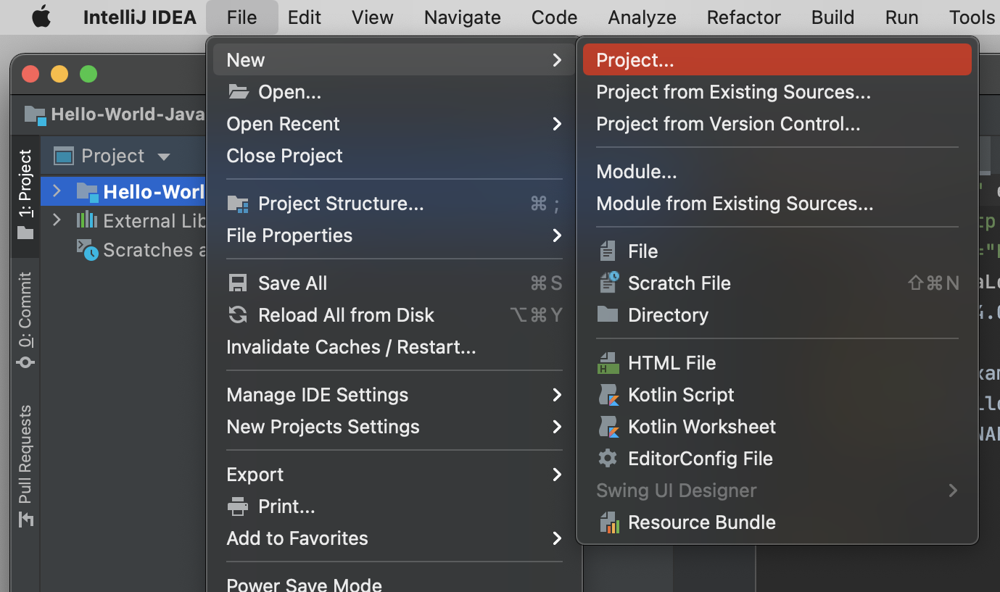

    OR

    If you are at the IntelliJ start screen, select `New Project`
    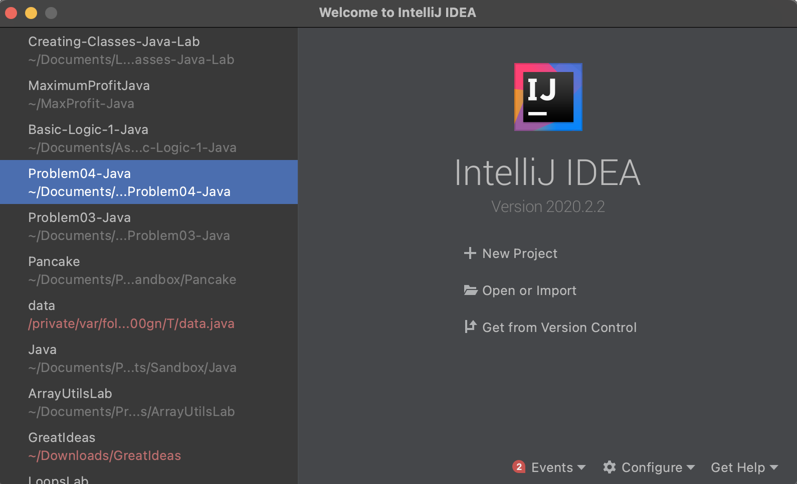

1. In the window that appears, make sure maven is highlighted and then select next.

    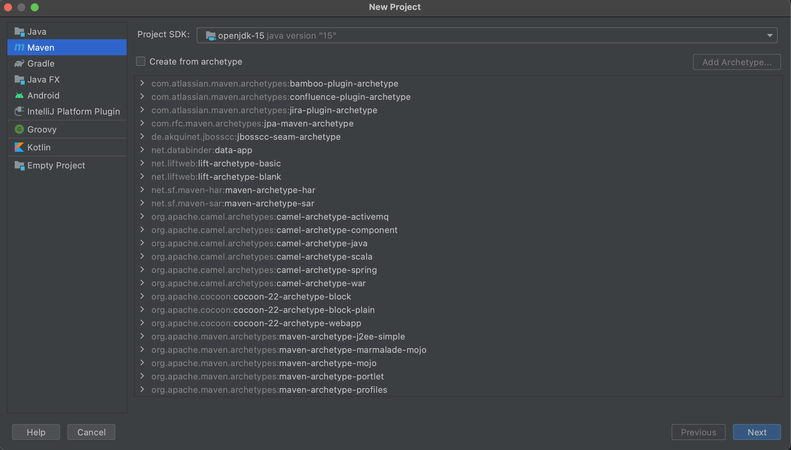

1. The window that appears next prompt you for your Project name and location. Navigate to the folder that was created when you cloned the lab repo from GitHub. Make sure the name of the project matched the folder. Your location and folder name may differe from mine. When you are done, select finish.

    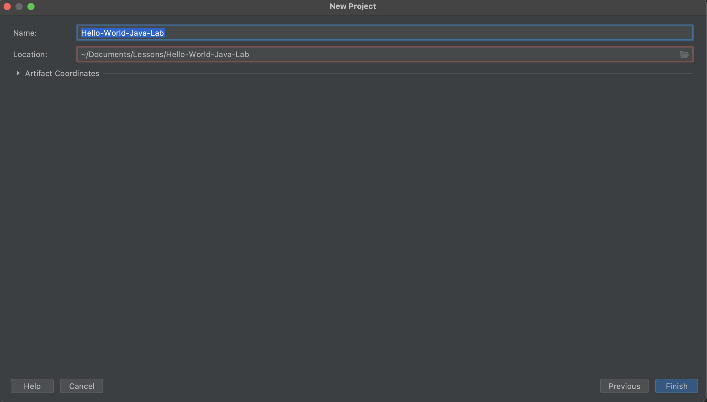

## Step 2: Create a new package

1. Navigate to the `src/main/java` folder in the project tab.
1. Right click on the `java` folder and create a new package named `codediff.stayready.labs`.

    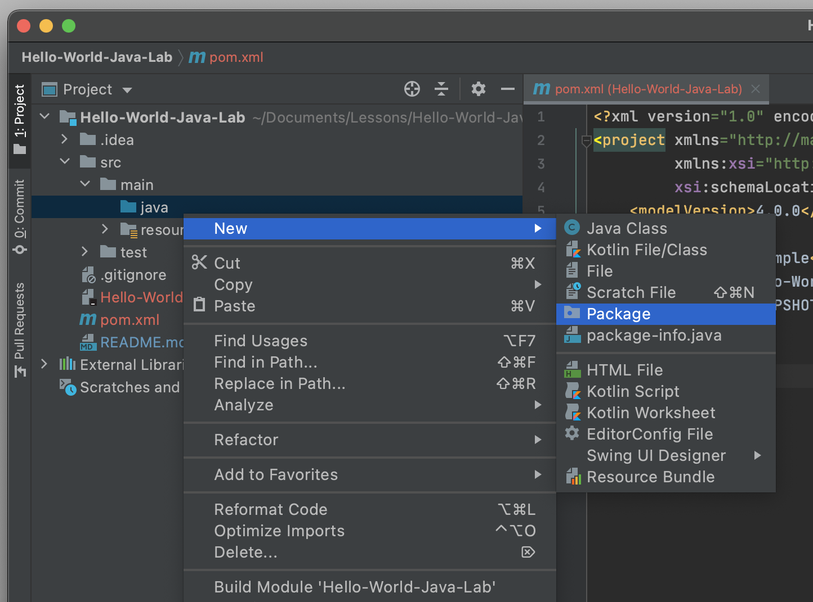

    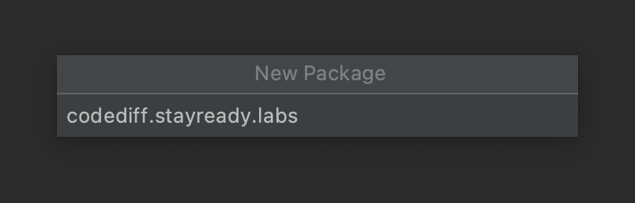

## Step 3: Create a class called HelloWorld

1. Within the AcmeOrderSystem project, right click on the `labs` folder (it will appear as `codediff.stayready.labs` in IntelliJ). Then select `New` -> `Java Class`

    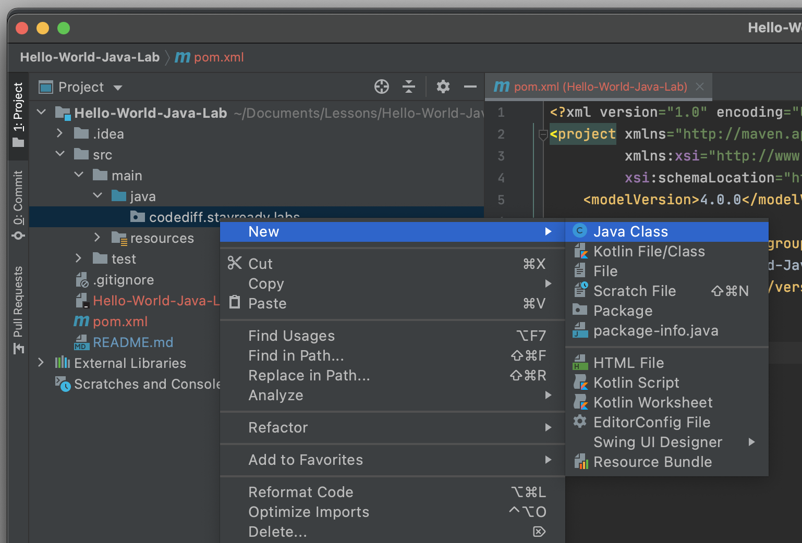

1. In the dialog window that displays, enter `HelloWorld` as the name of the class, and press Enter. This will create a file `HelloWorld.java` in the `labs` folder of the project.

    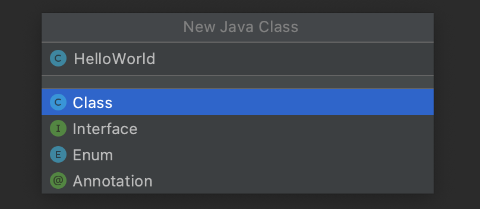

1. Open the file, if it did not already, add the following code, and save.

```java
public class HelloWorld{
    public static void main(String[] args){
        System.out.println("Hello, World");
    }
}
```

## Step 4: Running your Code

1. Click the green arrow next to `public static void main`. When you do so, this will tell IntelliJ to Run your code.

    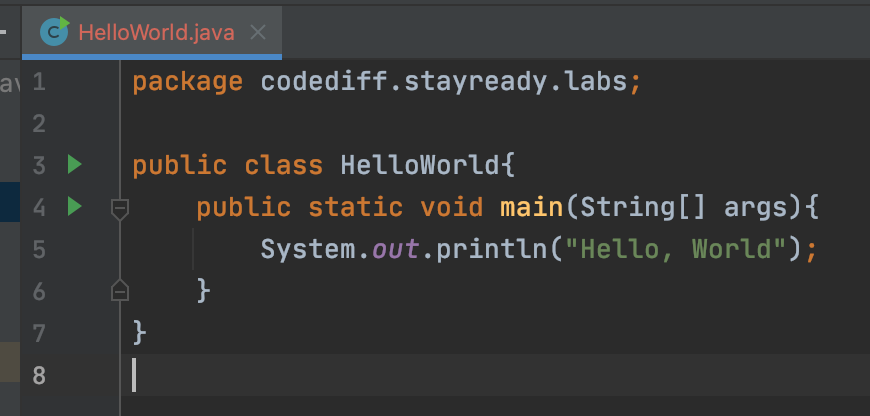

1. View the results of the code in the terminal window. You should see the text `Hello, World`.

     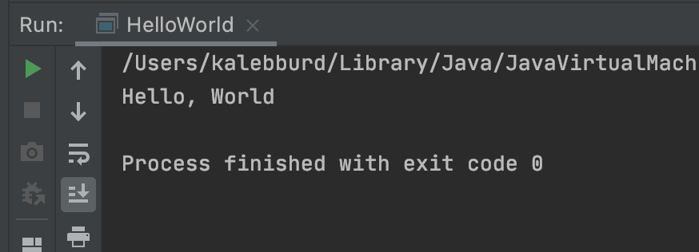

1. Modify the message to display the following info about yourself. An example of what we are looking for can be seen below can be seen below.
   - Name
   - Hometown
   - Major
   - Favorite Song
   - Favorite Superhero
   - Favorite Caffeine Source

    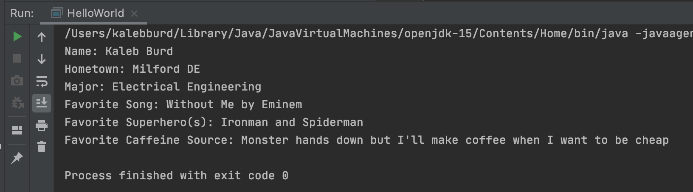

## Step 5: Submission

Commit and push all your changes to your repository
